## Overview

This describes a GitOps deployment using Flux CD with these components:

- Infrastructure Controllers
- Infrastructure Configurations
- Applications
- Notifications

## 🏗️ Infrastructure Layer

The infrastructure layer consists of two distinct Kustomization resources that manage platform-level components with different reconciliation patterns.

[⚙️ infrastructure.yaml](./infrastructure.yaml)

### [Infrastructure Controllers](../../infrastructure/controllers/)

**Purpose**: Bootstrap and maintain the core Flux CD control plane and essential cluster operators.

**Technical Implementation**:

- Flux CD actively watches configuration changes in `piksel-gitops/infrastructure/controllers`
- Utilizes Kustomize to manage controller deployments and configurations across environments, enabling consistent operator lifecycle management
- Implements a 1-hour reconciliation interval to provide stability for critical infrastructure components
- Serves as the foundational layer with no upstream dependencies, ensuring cluster bootstrapping capability

**Controllers being deployed**:

- `cert-manager.yaml` : Manages SSL/TLS certificates automatically
- `ingress-nginx.yaml` : HTTP/HTTPS ingress controller for routing traffic
- `db-proxy.yaml` : Database proxy component
- `notifications.yaml` : Notification system
- `nvidia-device-plugin.yaml` : GPU support for workloads

### [Infrastructure Configurations](../../infrastructure/configs/)

**Purpose**: This manages the configuration for those controllers

**Technical Implementation**:

- Flux CD monitors configuration changes in `piksel-gitops/infrastructure/configs`
- Utilizes Kustomize to manage environment-specific infrastructure settings, allowing configuration drift prevention across clusters
- Implements dependency relationship with infra-controllers through `dependsOn` specification
- Maintains shorter reconciliation intervals for configuration updates without affecting core operators

**Configurations being deployed**:

- `cluster-issuers.yaml` : Certificate issuer configurations (works with cert-manager)

## 📱 Applications Layer

**Purpose**: Deploy and manage business applications with environment-specific configurations and automated dependency resolution.

**Technical Implementation**:

- Flux CD continuously monitors application definitions in `piksel-gitops/apps/development`
- Utilizes Kustomize overlay pattern to manage environment-specific configurations, enabling configuration inheritance and environment promotion workflows
- Implements 1-minute reconciliation interval for rapid application iteration and deployment feedback
- Enforces dependency relationship with infra-configs through `dependsOn`, ensuring platform readiness before application deployment

**Application Portfolio**:

- `argo`: Argo Workflows for data processing pipeline execution and workflow management
- `jupyterhub`: JupyterHub multi-user environment with persistent storage and resource management
- `jupyterdask`: Jupyter-Dask integration for scalable data processing workloads
- `monitoring`: Prometheus metrics collection, Grafana visualization, and Loki log aggregation
- `odc`: Open Data Cube (ODC) for satellite imagery analysis and processing
- `stac`: SpatioTemporal Asset Catalog (STAC) API for geospatial metadata management
- `terria`: Terria Map for interactive geospatial data exploration
- `tileserver`: Map tile server for optimized geospatial data delivery

## 📢 Notification Layer

**Purpose**: Provide real-time observability and operational awareness through automated event monitoring and team communication.

**Technical Implementation**:

- Flux CD Notification Controller monitors all GitRepository and Kustomization resources within the cluster
- Utilizes event filtering with configurable severity levels to manage notification noise and relevance
- Implements provider abstraction pattern enabling multiple notification channels and escalation policies
- Maintains persistent connection to external communication platforms for real-time event delivery

**Event Monitoring Scope**:

- **GitRepository Events**: Source synchronization status, authentication failures, and repository accessibility
- **Kustomization Events**: Resource reconciliation status, deployment health checks, and configuration drift detection
- **Severity Filtering**: Configurable event severity thresholds to control notification frequency and urgency
- **Resource Targeting**: Wildcard selectors enable comprehensive monitoring across all managed resources

## Deployment Flow

### Flow Diagram

```mermaid
graph TD
    A[Developer pushes code] --> B[Git Repository]

    B --> C[Flux detects changes]
    C --> D{What changed?}

    D -->|Infrastructure| E[Deploy Controllers]
    E --> F[Deploy Infra Configs]
    F --> G[Infrastructure Ready ✅]

    D -->|Applications| H[Wait for Infrastructure]
    H --> I[Deploy Applications]
    I --> J[Applications Ready ✅]

    G --> K[Slack: Infrastructure deployed]
    J --> L[Slack: Applications deployed]

    M[Any failures] --> N[Slack: Alert team 🚨]
```

1. **Developer pushes code** to Git repository
2. **Flux detects changes** within sync intervals
3. **Infrastructure deploys first** (if infrastructure changed)
4. **Applications deploy second** (waits for infrastructure)
5. **Notifications sent** to Slack for all events

### Reconciliation Strategy

- **Infrastructure Controllers**: 1-hour interval prevents frequent restarts of critical operators
- **Infrastructure Configurations**: Configurable interval balances configuration updates with system stability
- **Applications**: 1-minute interval enables rapid development feedback and deployment validation
- **Notifications**: Event-driven processing provides immediate operational feedback
